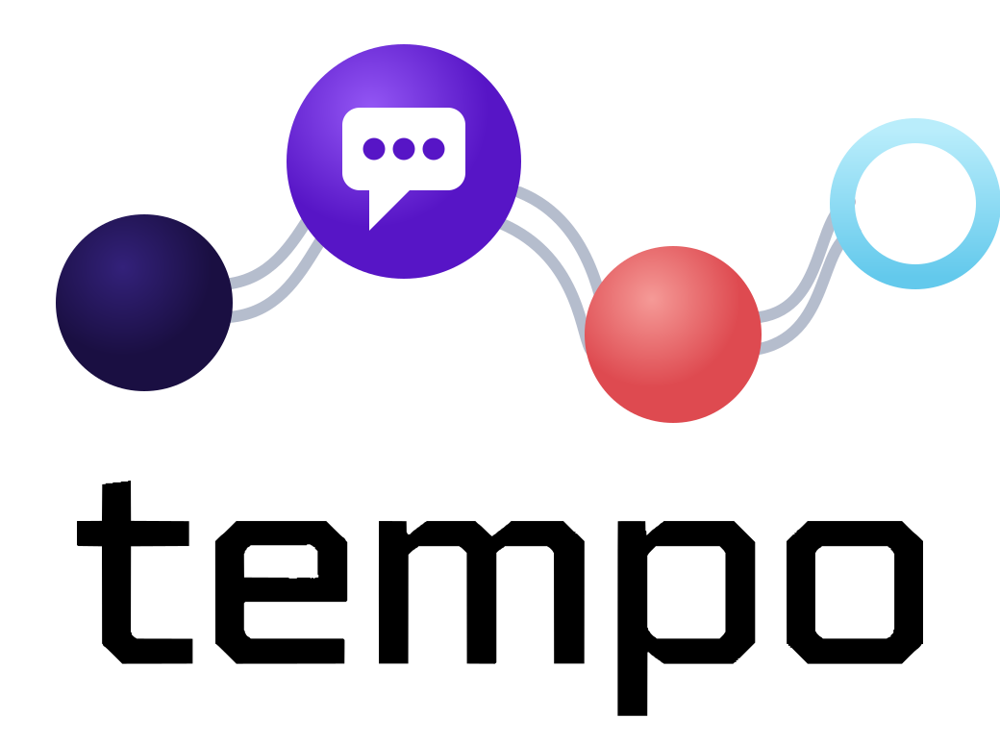

**Tracking, Engagement, Messaging & Participant Outreach**

**[dzweben.github.io/tempo](https://dzweben.github.io/tempo/)**

[](https://doi.org/10.5281/zenodo.22925367)

A self-hosted server for any research study that sends scheduled surveys and
reminders. If your participants have dates attached to them — an enrollment
date, a visit date, a cycle start — and things need to go out relative to those
dates, on time, conditionally, for months or years, TEMPO runs that.

You declare what should be sent and when. TEMPO works out who is owed what,
sends it by text and email at the right moment, refuses to send it twice, and
keeps an auditable record of every message.

It is not a survey platform. Your survey database stays the single source of
truth. TEMPO is the automation and observability layer around it.

---

## What it does

- **Scheduled multi-channel messaging.** SMS through a messaging API and email
  through SMTP, with per-message-type channel routing (some messages text only,
  some email only, some both, fanning out to a participant's multiple contacts).
- **Momentary-assessment (EMA) prompt delivery.** Fixed prompt grids — e.g. 25
  prompts at specific weekday/clock-minute slots over a 10-day cycle — delivered
  to the second, with a configurable grace period after which a late prompt is
  recorded as a protocol skip rather than sent at the wrong time.
- **Recurring survey cycles.** Monthly (or any cadence) invite + follow-up
  sequences computed from a single anchor date per participant, where follow-ups
  stop queueing the moment the survey is completed.
- **Visit, at-home and payment/compensation flows.** Reminders and notices with
  their own cadences, conditions and expiry rules.
- **Completion tracking and dashboards.** A password-gated web dashboard showing
  roster status, per-instrument completion, upcoming outgoing messages, the sent
  log, EMA cycle progress, and daily reconciliation audits.
- **Just-in-time survey links.** Personal survey URLs are resolved at send time
  from the survey database; a message whose link cannot be resolved is never
  sent with a broken link.
- **A daily audit.** Every planned send is mechanically reconciled against what
  actually happened, so a missed message surfaces the next morning instead of at
  the end of the study.

## Safety rails

Research messaging is high-stakes: participants are real people, many of them
minors, and a double-send or a 3 a.m. text is a protocol problem. TEMPO's
delivery path is built defensively.

- **Opt-outs and pauses.** A participant who asks to stop is excluded at both
  queue-generation and send time; individual participants can be paused.
- **Quiet hours.** Nothing transmits outside a fixed daily window
  (currently a constant in the sender; see `scripts/send-due-messages.mjs`).
- **Idempotency ledgers.** Append-only logs keyed per (message, channel,
  recipient); ledgers union-merge so concurrent runs can never erase each
  other's rows.
- **Carrier-history arbitration.** Before a late or rescued send, the sender
  asks the messaging provider whether that exact message already reached that
  participant — the provider's own history is the tiebreaker, so independent
  senders cannot double-send.
- **Send claims.** A sender claims a slot before transmitting, so two concurrent
  invocations resolve to exactly one send.
- **Kill switch.** A single runtime flag flips the whole system to dry-run
  without a redeploy; dry-run rows never satisfy "already sent."
- **Catch-up horizon and caps.** Late messages are delivered only within a
  bounded window, and a per-run cap prevents a runaway blast.

## How it works

```
 survey database  ──▶  fetch pipeline  ──▶  derived queues  ──▶  senders  ──▶  participants
  (source of truth)     (snapshot +          (who/what/when)     (SMS + email)
                         schedule math)              │                │
                                                     ▼                ▼
                                              dashboard + audit    ledgers
```

1. **Declare.** Every automated message is a row in a timeline spec: its
   condition, its send-date rule, its destination fields, its channels, and its
   template with merge placeholders and survey-link tokens. The spec can be
   generated from a coordinator-maintained spreadsheet, so message wording and
   cadence stay in the hands of the people who own the protocol.
2. **Fetch.** A pipeline pulls the study database on a schedule (per-event,
   chunked, with retry/backoff), pivots it into one record per participant,
   optionally merges coordinator-maintained visit dates from a spreadsheet, and
   computes every participant's derived schedule.
3. **Queue.** The pipeline writes a future-only display queue (what coordinators
   see) and a sender working set (what may transmit now), plus the
   momentary-assessment prompt grid with pre-resolved links.
4. **Send.** Senders run on a clock, apply the rails above, transmit, and write
   the ledger. Prompt delivery waits inside the invocation to fire on the exact
   second rather than trusting a scheduler's punctuality.
5. **Observe.** The dashboard reads the same files; the daily audit reconciles
   planned versus actual and flags anything unaccounted for.

## Deployment model

TEMPO runs without an always-on server. The web dashboard deploys as a
serverless app and scheduled work runs as serverless cron invocations, with
optional batch jobs on a CI runner.

State is two things: **snapshots** (the derived roster and send queues) and
**ledgers** (the append-only record of what was sent). The reference
implementation keeps both as JSON in an access-controlled store with
compare-and-swap writes; object storage, a database or an encrypted volume work
equally well. See [SECURITY.md](SECURITY.md) for what TEMPO actually needs to
hold about a participant — a record identifier and a contact endpoint — and why
everything else is optional.

## Configuring it for your study

TEMPO is a reference implementation plus a reusable engine, not turnkey
multi-tenant software. Standing up a new study means:

1. **Timeline spec** (`src/lib/timeline.ts`) — the main configuration surface:
   your messages, conditions, cadences and templates.
2. **Field bindings** (`scripts/fetch-data.mjs`) — the one file that knows your
   database's event and field names.
3. **Eligibility and schedule rules** — cohort/age gates and anchor arithmetic
   for your protocol.
4. **Environment** — API credentials and deployment identifiers
   (see `.env.example`).
5. **Time zone and quiet hours** — currently constants (`America/New_York`,
   8:00 a.m.–9:30 p.m.) in the sender and utility modules; change them there.

The pieces that transfer unchanged: the sender engine and its rails, the ledger
and merge machinery, link resolution, the audit engine, auth, and the dashboard
shell. Reference CI skeletons are in `examples/workflows/` — they are taken from
a production deployment and are meant to be read and adapted, not run as-is.

## Stack

Next.js (App Router) · React · TypeScript · Tailwind CSS · Node ESM scripts ·
serverless cron · CI batch jobs · SMTP (nodemailer) · REST APIs for the survey
database and messaging provider.

## Who it is for

Any study whose outreach is driven by dates rather than by someone remembering.
Typical fits:

- **Longitudinal cohorts** — visit reminders, between-visit questionnaires, and
  follow-up sequences anchored to each participant's own timeline.
- **Momentary assessment (EMA/ESM)** — fixed or per-participant prompt grids
  delivered to the second over a sampling period.
- **Recurring survey cycles** — monthly or weekly waves with follow-ups that
  stop the moment someone responds.
- **Retention and compensation** — nudges, payment notices, expiry warnings.
- **Trials and registries** — any protocol where "day 3, day 7, day 14 after X"
  has to happen reliably and be provable afterward.

It suits a study large enough that manual sending has become a job, and long
enough that a missed window costs real data.

## Production use

TEMPO is extracted from servers that run NIH-funded longitudinal research,
where they have delivered momentary assessments, survey cycles, reminders and
compensation notices to several hundred participants. The defensive design of
the delivery path — claims, ledgers, provider arbitration, protocol-correct
skips — comes from that production experience rather than from theory.

This repository contains source files only. Study-specific identifiers were
replaced with placeholders, the timeline spec ships as a synthetic example
rather than a real protocol, and no participant data or credentials have ever
been committed here.

## License

See [LICENSE](LICENSE).

## Citation

Zweben, D. (2026). *TEMPO (Tracking, Engagement, Messaging & Participant Outreach):
automated survey scheduling and participant messaging for longitudinal studies*
[Computer software]. Zenodo. https://doi.org/10.5281/zenodo.22925367

That DOI always resolves to the newest version. To cite the exact release you
ran, use the version DOI instead — v1.0.0 is
[10.5281/zenodo.22925408](https://doi.org/10.5281/zenodo.22925408).
