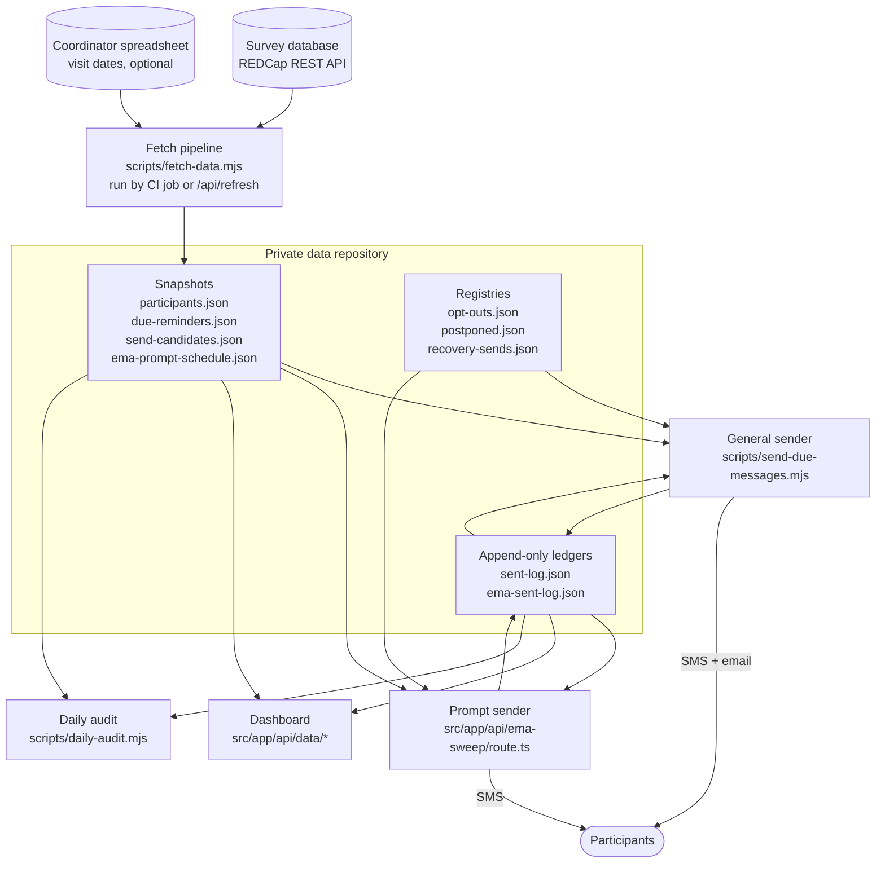

TEMPO has no always-on server and no database. It is a fetch pipeline, two senders, a
read-only dashboard, and a pile of JSON files under version control. This page walks the
whole mechanism, from the two execution planes down to the path a single text message
takes from a spec row to a participant's phone.

## The two planes

**Plane one is a serverless web app.** The Next.js App Router project in `src/app/`
deploys to Vercel and does three separate jobs from one codebase:

- **The coordinator dashboard** — `src/app/dashboard/*`, client components that fetch from
  `src/app/api/data/*/route.ts`.
- **A minute-cron prompt sender** — `src/app/api/ema-sweep/route.ts`.
- **A pipeline runner** — `src/app/api/refresh/route.ts`, which spawns the batch pipeline
  script inside the function.

The schedules are declared in `vercel.json`: `/api/ema-sweep` at `* * * * *` and
`/api/refresh` at `3,33 * * * *`. The refresh function gets its own resource envelope
there (`memory: 3009`, `maxDuration: 800`) because it forks a child Node process that
holds a full study export in memory.

**Plane two is optional CI batch jobs.** `examples/workflows/` holds the GitHub Actions
skeletons from the production deployment: `refresh-data.yml` (fetch, send, commit, deploy
in one serialized job), `daily-audit.yml`, `deploy-code.yml`, a manual
`send-due-messages.yml`, and a retired `ema-prompt-sender.yml`. They are reference
material, not a runnable `.github/workflows/` — the header in
`examples/workflows/README.md` says why.

Between the planes sits a two-variable control plane, read fresh on every invocation by
`ghVar()` in the refresh route: `SENDER_LEG` (`github` or `vercel`) decides which plane is
allowed to transmit, and `SEND_LIVE` is the study-wide kill switch. Both fail safe — if
either is unreadable, `dryRun` is true and nothing goes out. This is what makes it
possible to run two legs side by side without ever double-sending.

:::note
The two-plane split is not architectural elegance, it is scar tissue. The CI cron
scheduler starved this repository for two weeks in September 2026: prompt jobs fired hours
late and 21+ prompts were recorded as protocol skips. The header comment in
`examples/workflows/ema-prompt-sender.yml` documents the retirement. Minute-precision
delivery moved to the serverless route; batch work where lateness is harmless stayed
behind.
:::

## Data flow

`scripts/fetch-data.mjs` is the only file that knows your database's schema. It exports
records one event at a time (`fetchAllRecordsStreaming`, which streams each chunk straight
into a per-record bucket because a single bulk export exhausts the server's memory),
pivots each record into one participant object (`pivotParticipant`), optionally merges
coordinator-maintained visit dates from a spreadsheet (`fetchFollowupSheet`), materializes
every derived schedule, and resolves personal survey links in capped concurrent batches
(`batchAsync(tasks, 3, 200)`).

Its outputs are deliberately split. `computeDueReminders` builds one list, and `main()`
writes it twice:

| File | Contents | Consumer |
|---|---|---|
| `due-reminders.json` | strictly future items | dashboard display queue |
| `send-candidates.json` | the same plus items due in the last 24 h | the sender |

That split exists because a "due" item is by definition just-past. When both readers shared
the future-only file, every fetch pruned items seconds before the send step could fire
them, and an entire monthly cycle went out silently unsent.

The pipeline also refuses to publish a bad fetch. `last-fetch.json` carries a `metrics`
block that the *next* run reads as a baseline: if total rows drop below 60% of the previous
good run, or the roster below 75%, or a completion report that had rows returns zero while
its event still holds records, `main()` throws. The catch handler writes `ok: false` and
exits non-zero, so the last known-good data stays live.

## Why files instead of a database

All state is JSON in a private git repository: versioned snapshots, append-only ledgers,
and a few hand-maintained registries. Nothing here is a general recommendation — it is a
set of tradeoffs that happen to fit a study of a few hundred participants.

**What it buys.** Every write is a commit, so the audit trail is free and complete: you can
ask what the queue looked like on any past morning and get a byte-exact answer without
having designed a history table. A whole-file write is atomic at the filesystem level and
again at the commit level, so a reader never sees a half-updated queue. And the same bytes
serve the sender, the dashboard, and the audit, which removes a whole class of "the report
disagrees with the system" bugs.

**How concurrency works.** Writes through the GitHub contents API are compare-and-swap on
the file's sha. `ghPutRawFile` in the refresh route passes the sha it mirrored at the start
of the run; a conflict means another leg committed fresher data mid-run, and the route
**aborts the remaining writes** rather than forcing — newer data always wins, and the next
tick re-derives. The EMA sender uses the same primitive for something stronger: before
firing a slot it PUTs a `sending` claim row, and of several invocations waiting on the same
second, exactly one wins the PUT while the rest see the conflict and back off.

Write ordering is explicit where it matters. `ema-anchor-overrides.json` commits before any
schedule derived from it, and if the overrides write fails the schedule write is skipped.

**Ledgers are not snapshots.** Derived files are regenerated, so the CI rebase strategy
`-X theirs` is correct for them: freshest fetch wins. That strategy is catastrophic for
ledgers, where every row is a fact about a message that did or did not go out. On
2026-08-09 a dispatched run on a stale snapshot re-sent 74 messages and its commit then
erased the first run's 74 rows. `scripts/merge-ledgers.mjs` is the fix — it unions the
local ledger with `origin/main`'s copy before `git add`, keyed by `sendKey`, so whatever
the rebase does afterwards the committed file already contains both sides' rows.

**What it costs.** There are no indexes and no partial reads: `/api/data/participants`
parses the entire roster file per request, and the refresh route notes that file at around
9 MB. Memory is a real constraint — running the pipeline inside a serverless function
required a sandbox-only patch to `parseCSV` (see the `ANCHOR`/`PATCH` constants in
`src/app/api/refresh/route.ts`), because storing a property for every export column on
every row made ~4,000 rows weigh over 3 GB and OOM'd three runs. Concurrency control is
per-file and coarse, which is why the CI workflows all share one serialized
`concurrency: group: refresh-data`. And there is no query layer at all: anything the
dashboard wants must already have been computed into the snapshot.

:::note Choosing a store
Nothing in the delivery logic depends on the store being a git repository. What the code
requires is read-modify-write with an optimistic concurrency check — it reads a file with
its version, computes, and writes back only if the version still matches. Object storage
with preconditions, a managed database with row versions, or an encrypted volume all
satisfy that.

The reference implementation uses a repository reached through a scoped token
(`GITHUB_DATA_TOKEN`), because versioned history and conditional writes come for free.
If you keep that arrangement, the repository slug is a `REPO` constant in both
`src/app/api/refresh/route.ts` and `src/app/api/ema-sweep/route.ts`. Whatever you choose,
put it behind authentication and keep it out of anything you publish — see `SECURITY.md`.
:::

## One message, end to end

Take a survey-cycle invite.

1. **Spec row.** `src/lib/timeline.ts` declares the alert: its `alertId`, `wave`, `kind`,
   `condition`, `sendDateSpec`, `destinationSpec`, and `message` template with
   `[event][field]` placeholders and `[event][survey-link:instrument]` tokens.
2. **Schedule math.** `computeDueReminders` walks each participant's waves and emits a
   queue row with an ISO `scheduledAt`. Follow-ups are offsets from the cycle date and only
   queue while the survey is still incomplete. Opt-outs are excluded here.
3. **Link pre-resolution.** `linkSpec(d)` maps the queue row's `kind`/`alertId` back to an
   event and instrument, and the pipeline resolves the participant's personal URL onto the
   row (deduplicated by key, capped at 1,500 unique lookups per run).
4. **Window selection.** `scripts/send-due-messages.mjs` fires everything with
   `scheduledAt` in `(windowStart, now]`, where `windowStart` is
   `max(lastRunAt − 5 min, now − 18 h)`. The overlap is intentional and the ledger dedupes
   it. A first-ever run with no `send-state.json` seeds `windowStart = now`, so launch is a
   clean forward-only cutover rather than a backlog blast.
5. **Gates.** Opt-out registry (belt, even though the queue already excluded them),
   `postponed.json`, `complete`, `mode === "manual"`, quiet hours (before 8:00 AM or after
   9:30 PM Eastern — a quiet-hours run returns *without* advancing `lastRunAt`, so skipped
   items stay inside the next window), and a per-run channel cap that throws rather than
   blasting.
6. **Render.** `findTemplate` looks the row up in the timeline (parsed out of
   `timeline.ts` by regex in `loadTimeline`), `remapEventForWave` rewrites `_y2_` style
   event slugs to the participant's actual wave, unresolved links are fetched
   just-in-time, and `renderMessage` substitutes the merge fields.
7. **The link guard.** If the rendered body still contains `[SURVEY LINK PENDING]`, the
   message is **not sent**; a `skipped` ledger row is written instead. No participant ever
   receives a broken link.
8. **Fan-out and ledger.** `KIND_CHANNELS` decides SMS, email, or both; SMS goes to every
   contact phone on file, email to one address. Each channel send is keyed
   `pid|alertId|scheduledAt|channel|recipient` and skipped if that key is already in the
   ledger as a real send — dry-run rows deliberately do not count, so a rehearsal can never
   block the real send. The ledger is snapshotted to disk after every reminder so a crash
   loses nothing.

EMA prompts take a different path for one reason: 7:34 AM means 7:34 AM.
`src/app/api/ema-sweep/route.ts` reads the schedule and ledger **live** from the contents
API rather than from its own deploy bundle, buckets rows into due (within a 30-minute
protocol grace), expired (recorded as `skipped_late`), and upcoming (within a 75-second
look-ahead) — then **sleeps inside the invocation** and fires the upcoming ones at their
exact second. Before any send it asks the messaging provider whether that exact link
already reached that number (`alreadyDelivered`), because the carrier's own history is the
one arbiter every sender past and present shares.

## Auth

`src/middleware.ts` runs on everything except Next internals and static assets. Anything
not in `PUBLIC_PATHS` needs a valid cookie; unauthenticated API calls get a 401 and pages
get redirected to `/login` with a `next` parameter. `src/lib/auth.ts` implements the gate
with Web Crypto so the same code runs on Edge and Node: the cookie is
`issuedAt.HMAC-SHA256(secret, issuedAt)`, compared in constant time and expiring at 30
days. `src/app/api/login/route.ts` adds a per-IP in-memory rate limit (5 attempts / 15
minutes) that resets on cold starts — enough to slow a brute force on a low-traffic
dashboard, not a substitute for a strong `DASHBOARD_PASSWORD`.

The three scheduled routes are in `PUBLIC_PATHS` because cron callers have no login
cookie. They authenticate themselves with a shared secret via `x-sweep-secret`, `?secret=`,
or `Authorization: Bearer`, and 401 without it.

:::danger Known limitations
Time zone is hardcoded to `America/New_York` throughout, and `easternOffset()` in
`fetch-data.mjs` approximates DST by month boundaries (April–October is EDT) — good enough
for display on a 60-day horizon, wrong for the few days around each transition. Quiet hours
are constants in `send-due-messages.mjs`. Eligibility arithmetic is study-specific:
`emaEligibleCohort` hard-blocks record IDs 1000–1999, the roster is scoped to
`[1000, 3999]`, and alert-ID ranges (48–53, 54–59, 89–91, 93–95) are mapped back to survey
cycles by subtraction in three separate files. Finally, the dashboard's `/api/data/*`
routes read the copy of `private/data` **bundled into the deploy**, so dashboard freshness
is bounded by deploy cadence (throttled to roughly every two hours in the reference
workflow) even though the senders always read live.
:::
