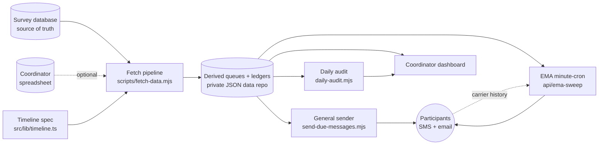

TEMPO — **T**racking, **E**ngagement, **M**essaging & **P**articipant **O**utreach — is a self-hosted server for any study whose outreach is driven by dates: momentary-assessment prompts, recurring survey cycles, visit and retention reminders, compensation notices. You declare what should be sent and when; TEMPO works out who is owed what, delivers it by text and email at the scheduled moment, refuses to send it twice, and keeps a record you can audit afterwards.

It is production software, not a prototype: the delivery design described in these pages comes from running NIH-funded longitudinal research, where the cost of a missed window is data you cannot recover.

## The problem

A longitudinal study is a promise about time. A participant agrees to be reached on a schedule — a monthly survey, a check-in text at 7:34 AM on the second Monday, an at-home questionnaire the evening after a lab visit, a compensation link ninety days out — and then that schedule has to actually happen, for every participant, on staggered personal anchors, for years.

The failure modes are unglamorous and expensive:

- A prompt fires two hours late. Momentary assessment is a measurement of *this moment*; a late prompt is not a delayed data point, it is a different and unusable one.
- A participant gets the same message twice because two schedulers both thought it was theirs. That is a protocol deviation and a trust cost with a real person, often a minor.
- A survey link fails to resolve and the participant receives a message containing a literal placeholder.
- A cron job silently stops, and nobody notices for two weeks. That one is in the code's comments because it happened.

Most labs solve this with a survey tool's built-in alerts plus a coordinator, a spreadsheet and a calendar reminder. That works until the schedule is conditional, the cadence is personal, and the study is three years long.

## What TEMPO does

TEMPO sits **between** the systems a study already has — its survey database of record (a REDCap-compatible REST API) and its messaging providers (an OpenPhone-compatible SMS API plus SMTP) — and turns a declarative timeline spec into messages that go out on time, with a mechanical record of every one.

Every automated message is one declarative row in `src/lib/timeline.ts`: its condition, its send-date rule, its destination fields, its channels, and its template. Nothing else in the codebase decides what gets sent. A fetch pipeline resolves that spec against live study data into concrete queues; senders fire from those queues under a stack of safety rails; a daily job reconciles what was planned against what happened.

## Capabilities

| Capability | Where it lives |
|---|---|
| Declarative message timeline — condition, cadence, channels, template | `src/lib/timeline.ts` |
| Scheduled pull, pivot, and per-participant schedule math | `scripts/fetch-data.mjs` |
| Multi-channel send with quiet hours, caps, opt-outs, catch-up window | `scripts/send-due-messages.mjs` |
| Exact-second momentary-assessment (EMA) prompt delivery | `src/app/api/ema-sweep/route.ts` |
| Long-lived segment-job alternative for prompt delivery | `scripts/send-ema-prompts.mjs` |
| Just-in-time personal survey-link resolution | `resolveSurveyLink()` in the sender |
| Daily planned-vs-actual reconciliation with GREEN/YELLOW/RED verdict | `scripts/daily-audit.mjs` |
| Password-gated coordinator dashboard, ten views | `src/app/dashboard/`, `src/middleware.ts` |
| Union-merging append-only ledgers | `scripts/merge-ledgers.mjs` |

:::tip Why the delivery path looks over-engineered
Because it is load-bearing. The sender refuses to transmit a message whose survey link did not resolve, aborts the whole run rather than exceed a per-run cap, treats a dry-run ledger row as *not* satisfying "already sent," and — before any late or rescued prompt — asks the messaging provider's own message history whether that exact text already reached that participant. Each of those rails corresponds to a real production incident. [Architecture](/docs/architecture) walks through them.
:::

## What TEMPO is not

:::warning Scope, stated plainly
**Not a survey platform.** TEMPO never owns response data. Your survey database stays the single source of truth; TEMPO reads it, schedules against it, and writes nothing back to it.

**Not a CRM.** There is no contact pipeline, no campaign builder, no message composer. Message copy lives in the timeline spec, ideally generated from a spreadsheet the coordinators maintain.

**Not multi-tenant SaaS.** One deployment serves one study. There is no tenant model, no per-study configuration UI, and a single dashboard password rather than user accounts.

**Not turnkey.** TEMPO is a reference implementation plus a reusable engine. Standing up a new study is a fork-and-adapt exercise, measured in days of engineering, not minutes of setup.
:::

Some limitations are worth knowing before you invest an afternoon. The time zone is a hardcoded `America/New_York` constant in the sender, the prompt sender, the audit and the dashboard's formatters. Quiet hours (8:00 AM to 9:30 PM) are likewise constants in `scripts/send-due-messages.mjs`. Several eligibility rules are study-specific arithmetic rather than configuration — an age gate for 13+ instruments, a participant-ID range that is excluded from momentary assessment entirely, and completion re-checks that map alert-ID ranges back to survey cycles. Those are all things you will edit, not configure.

The pieces that transfer unchanged are the valuable ones: the sender engine and its rails, the ledger and merge machinery, link resolution, the audit engine, auth, and the dashboard shell.

## Where to go next

- **[Architecture](/docs/architecture)** — the data flow end to end, the defensive delivery design, and why each rail exists.
- **[Quickstart](/docs/quickstart)** — clone, configure the environment, run the pipeline in dry-run mode, and see the dashboard locally.
- **[Timeline spec](/docs/timeline-spec)** — the field-by-field reference for the one file you will spend the most time in.

:::note
The public repository is a clean-room extraction: source files only, study identifiers replaced with placeholders, and a synthetic example timeline. No participant data and no credentials have ever been committed to it. Participant data belongs in a private store — see `SECURITY.md` in the repository.
:::
